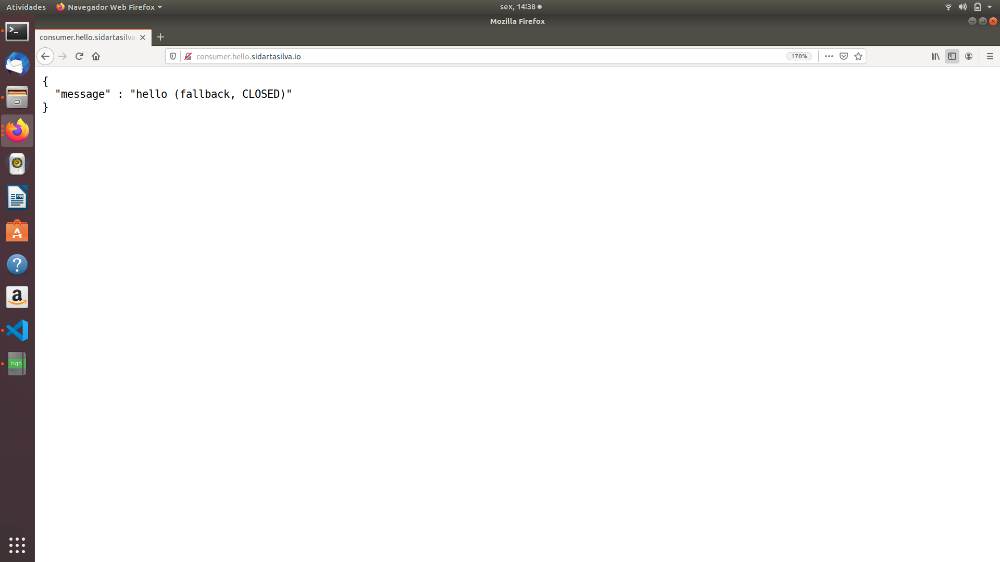
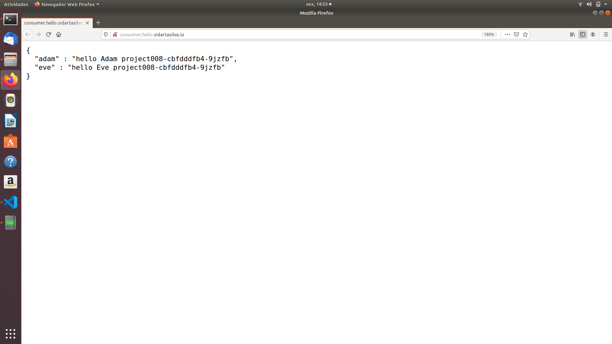

# Building Reactive Microservice Systems

This project is based mainly on the references below.

    ESCOFFIER, C. Building Reactive Microservices in Java Asynchronous and Event-Based Application Design. First Edition. California: O’Reilly Media, Inc., 2017.

    RedHat Developer, accessed 1 November 2019, <https://developers.redhat.com/promotions/building-reactive-microservices-in-java>

    Kubernetes Hands-On - Deploy Microservices to the AWS Cloud 2018, Udemy, accessed 1 November 2019, <https://www.udemy.com/course/kubernetes-microservices>

    <https://github.com/hazelcast/hazelcast-code-samples/>

    <https://vertx.io/docs/vertx-hazelcast>

## Stability and Resilience Patterns

When dealing with distributed systems, failures are first-class citizens and we have to live with them.

Our microservices must be aware that the services they invoke can fail for many reasons.

Every interaction between microservices will eventually fail in some way, and you need to be prepared for that failure.

Failure can take different forms, ranging from various network errors to semantic errors.

### Managing Failures in Reactive Systems.

Reactive microservices are responsible for managing failures locally.

They must avoid propagating the failure to another microservice.

In other words, we should not delegate the hot potato to another microservice.

Therfore, the code of a reactive microservice considers failures as first-class citizens.

The Vert.x. development model makes failures a central entity. When using the callback development model, the Handlers often receive an AsyncResult as a parameter. This structure encapsulates the result of an asynchronous operation.

In the case of success, you can retrieve the result. On failure, it contains a Throwable describing the failure:

            client.get("/").as(BodyCodec.jsonObject())
                    .send(ar -> {
                        if (ar.failed()) {
                            Throwable cause = ar.cause();
                            // You need to manage the failure
                        } else {
                            // It's a success
                            JsonObject json = ar.result().body();
                        }
                    });

When using the RxJava APIs, the failure management can be made in the subscribe method:

            client.get("/").as(BodyCodec.jsonObject())
                    .rxSend()
                    .map(HttpResponse::body)
                    .subscribe(
                        json -> { /* success */},
                        err -> { /* failure */ }
                    );

If a failure is produced in one of the observed streams, the error handler is called. We can also handle the failure earlier, avoiding the error handler in the subscribe method:

            client.get("/").as(BodyCodec.jsonObject())
                    .rxSend()
                    .map(HttpResponse::body)
                    .onErrorReturn(t -> {
                        // Called if rxSend produces a failure
                        // We can return a default value
                        return new JsonObject();
                    })
                    .subscribe(
                        json -> {
                            // Always called, either with the actual result
                            // or with the default value
                        }
                    );

Managing errors is not fun but it has to be done. The code of a reactive microservice is responsible for making an adequate decision when facing a failure. It also needs to be prepared to see its requests to other microservices fail.

### Using Timeouts

When dealing with distributed interactions, we often use timeouts. A timeout is a simple mechanism that allows you to stop waiting for a response once you think it will not come. Well-placed timeouts provide failure isolation, ensuring the failure is limited to the microservice it affects and allowing you to handle the timeout and continue your execution in a degraded mode.

                client.get(path)
                    .rxSend()   // Invoke the service
                    // We need to be sure to use the Vert.x event loop
                    .subscribeOn(RxHelper.scheduler(vertx))
                    // Configure the timeout, if no response, it publishes
                    // a failure in the Observable
                    .timeout(5, TimeUnit.SECONDS)
                    // In case of success, extract the body
                    .map(HttpResponse::bodyAsJsonObject)
                    // Otherwise use a fallback result
                    .onErrorReturn(t -> {
                        // timeout or another expression
                        return new JsonObject().put("message", "D'oh! Timeout");
                    })
                    .subscribe(
                        json -> System.out.println(json.encode())
                    );

Timeouts are often used together with retries. When a timeout occurs, we can try again. Immediately retrying an operation after a failure has a number of effects, but only some of them are beneficial.

If the operation failed because of a significant problem in the called microservice, it is likely to fail again if retried immediately. However, some kinds of transient failures can be overcome with a retry, especially network failures such as dropped messages. You can decide whether or not to reattempt the operation as follows:

                    client.get(path)
                            .rxSend()
                            .subscribeOn(RxHelper.scheduler(vertx))
                            .timeout(5, TimeUnit.SECONDS)
                            // Configure the number of retries
                            // here we retry only once
                            .retry(1)
                            .map(HttpResponse::bodyAsJsonObject)
                            .onErrorReturn(t -> {
                                return new JsonObject().put("message", "D'oh! Timeout");
                            })
                            .subscribe(
                                json -> System.out.println(json.encode())
                            );

It is alo important to remember that a timeout does not imply an operation failure. In a distributed system, there are many reasons for failure. Let's look at an example. You have two microservices, A and B. A is sending a request to B, but the response does not come in time and A gets a timeout. In this scenario, three types of failure could have occurred:

1. The message between A and B has been lost - the operation is not executed.

2. The operation in B failed - the operation has not completed its execution.

3. The response message between B and A has been lost - the operation has been executed successfully, but A didn't get the response.

This last case is often ignored and can be harmful. In this case, combining the timeout with a retry can break the integrity of the system. Retries can only be used with idempotent operations, i.e., with operations you can invoke multiple times without changing the result beyond the initial call. Before using a retry, always check that your system is able to handle reattempted operations gracefully.

Retry also makes the consumer wait even longer to get a response, which is not a good thing either. It is often better to return a fallback than to retry an operation too many times. In addition, continually hammering a failing service may not help it get back on track. These two concerns are managed by another resilience pattern: the circuit breaker.

### Circuit Breakers

A circuit breaker is a pattern used to deal with repetitive failures. It protects a microservice from calling a failing service again and again. A circuit breaker is a three-state automaton that manages an interaction. It starts in a closed state in which the circuit breaker executes operations as usual. If the interaction succeeds, nothing happens. If it fails, however, the circuit breaker makes a note of the failure. Once the number of failures (or frequency of failures, in more sophisticated cases) exceeds a threshold, the circuit breaker switches to an open state.

In this state, calls to the circuit breaker fail immediately without any attempt to execute the underlying interaction.

Instead of executing the operation, the circuit breaker may execute a fallback, providing a default result.

After a configured amount of time, the circuit breaker decides that the operation has a chance of succeeding, so it goes into a half-open state. In this state, the next call to the circuit breaker executes the underlying interaction.

Depending on the outcome of this call, the circuit breaker resets and returns to the closed state, or returns to the open state until another timeout elapses.

The most well-known circuit breaker implementation in Java is Hystrix. While you can use Hystrix in a Vert.x microservice (it uses a thread pool), you need to explicitly switch to the Vert.x event loop to execute the different callbacks.

Alternatively, you can use the Vert.x circuit breaker built for asynchronous operations and enforce the Vert.x nonblocking asynchronous development model.

Let's imagine a failing hello microservice. The consumer should protect the interactions with this service and use a circuit breaker as follows:

                CircuitBreaker circuit = CircuitBreaker.create("my-circuit",
                
                    vertx, new CircuitBreakerOptions()
                        .setFallbackOnFailure(true)     // Call the fallback
                                                        // on failures
                        .setTimeout(2000)               // Set the operation
                                                        // timeout 
                        .setMaxFailures(5)              // Number of failures
                                                        // before switching to 
                                                        // the 'open' state
                        .setResetTimeout(5000)          // Time before
                                                        // attempting to reset
                                                        // the circuit breaker
                );
                // ...
                circuit.rxExecuteCommandWithFallback(
                    future -> 
                        client.get(path)
                            .rxSend()
                            .map(HttpResponse::bodyAsJsonObject)
                            .subscribe(future::complete, future::fail),
                    t -> new JsonObject().put("message", "D'oh! Fallback")
                )
                .subscribe(
                        json -> {
                            // Get the actual json or the fallback value
                            System.out.println(json.encode());
                        }
                );

In this code, the Http interaction is protected by the circuit breaker. When the number of failures reaches the configured threshold, the circuit breaker will stop calling the microservice and instead call a fallback.

Periodically, the circuit breaker will let one invocation pass through to check whether the microservice is back on track and act accordingly. This example uses a web client, but any interaction can be managed with a circuit breaker and protect you against flaky services, exceptions, and other sorts of failures

A circuit breaker switching to an open state needs to be monitored by your operations team. Both Hystrix and the Vert.x circuit breaker have monitoring capabilities.

### Health Checks and Failovers

While timeouts and circuit breakers allow consumers to deal with failures on their side, what about crashes?

When facing a crash, a failover strategy restarts the parts of the system that have failed.

But before being able to achieve this, we must be able to detect when a microservice has died.

A health check is an API provided by a microservice indicating its state.

It tells the caller whether or not the service is healthy. The invocation often uses Http interactions but is not necessary.

After invocation, a set of checks is executed and the global state is computed and returned.

When a microservice is detected to be unhealthy, it should not be called anymore, as the outcome is probably going to be a failure. Note that calling a healthy microservice does not guarantee a success either. A health check merely indicates that the microservice is running, not that it will accurately handle your request or that the network will deliver its answer.

Depending on your environment, you may have different levels of health checks. For instance, you may have a readiness check used at deployment time to determine when the microservice is ready to serve requests (when everything has been initialized correctly). Liveness checks are used to detect misbehaviors and indicate whether the microservice is able to handle requests successfully. When a liveness check cannot be executed because the targeted microservice does not respond, the microservice has probably crashed.

In a Vert.x application, there are several ways to implement health checks. You can simply implement a route returning the state, or even use a real request. You can also use the Vert.x health check module to implement several health checks in your application and compose the different outcomes. The following code gives an example of an application providing two levels of health checks:

            Router router = Router.router(vertx);
            HealthCheckHandler hch = HealthCheckHanlder.create(vertx);
            // A procedure to check if we can get a database connection
            hch.register("db-connection", future -> {
                client.rxGetConnection()
                    .subscribe(
                        c -> {
                            future.complete();
                            c.close();
                        },
                        future::fail
                    );
            });
            // A second (business) procedure
            hch.register("business-check", future -> {
                // ...
            });
            // Map /health to the health check handler
            router.get("/health").handler(hch);
            // ...

After you have completed health checks, you can implement a failover strategy. Generally, the strategy just restarts the dead part of the system, hoping for the best. While failover if often provided by your runtime infrastructure, Vert.x. offers a built-in failover, which is triggered when a node from the cluster dies. With the built-in Vert.x failover, you don't need a custom health check as the Vert.x cluster pings nodes periodically. When Vert.x loses track of a node, Vert.x chooses a healthy node of the cluster and redeploys the dead part.

Failover keeps your system running but won't fix the root cause - that's your job. When an application dies unexpectedly, a postmortem analysis should be done.

### Using a Circuit Breaker

While using health checks avoids calling a microservice that is not ready and restarts dead ones, we still need to protect ourselves from other failures such as timeouts, network outage, bugs in the called microservice, and so on.

In this section we are going to protect the hello consumer using a circuit breaker.

The code of this section is located in the project-009 directory.

In the verticle, we are using a single circuit breaker to protect against the two calls to the hello microservice.

The following code uses this design; however, it's just one among a large set of possible approaches, such as using one circuit breaker per call, using a single circuit breaker but protecting the two calls independently, etc.

            private void invokeHelloMicroservice(RoutingContext rc) {
                circuit.rxExecuteCommandWithFallback(
                    future -> {
                        HttpRequest<JsonObject> request1 = hello.get("/Adam")
                            .as(BodyCodec.jsonObject());
                        
                        HttpRequest<JsonObject> request2 = hello.get("/Eve")
                            .as(BodyCodec.jsonObject());

                        Single<JsonObject> s1 = request1.rxSend().map(HttpResponse::body);

                        Single<JsonObject> s2 = request2.rxSend().map(HttpResponse::body);

                        Single.zip(s1, s2, (adam, eve) -> {
                            // We have the result of both request in Adam and Eve
                            return new JsonObject()
                                    .put("adam", adam.getString("message") + " " + adam.getString("served-by"))
                                    .put("eve", eve.getString("message") + " " + eve.getString("served-by"));
                            
                        })
                        .subscribe(future::complete, future::fail);
                    },
                    error -> new JsonObject().put("message", "hello (fallback, " + circuit.state().toString() + ")")
                )   
                .subscribe(
                    x -> rc.response().end(x.encodePrettily()),
                    t -> rc.response().end(t.getMessage())
                );
            }

In case of error, we provide a fallback message indicating the state of the circuit breaker. This will help us understand what's going on.

Now let's scale down the hello microservice to 0. To do this, we can run:

            kubectl scale --replicas=0 deployment/project008

Now if we refresh the consumer page (http://consumer.hello.sidartasilva.io), we should see the fallback message. The first three requests show:

Once the number of failures is reached, it returns:

If we restore the number of replicas to 2 with:

            kubectl scale --replicas=2 deployment/project008

we should get back the normal output once the microservice is ready.

